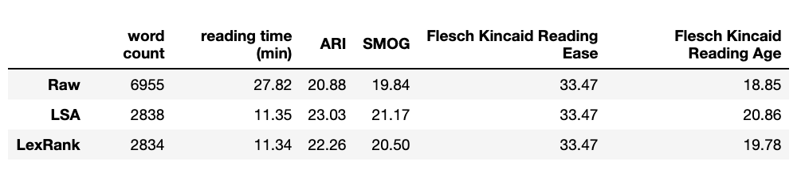
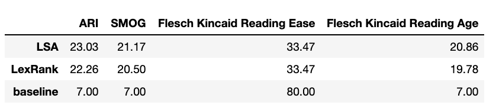

# NLP Project - Text Summarization of IPCC Report

## Motivation 

Climate change action can suffer from a number of communication issue when it comes to governmental bodies disseminating information to the general public. Specifically, the process of reading official climate change reports can be hampered from the material's high level of complexity and use of jargon. 

This natural language processing project aims to make the IPCC summary (https://www.ipcc.ch/sr15/chapter/spm/) more readable by completing one or more of the following objectives:

- Reduce the average reading difficulty (using the reading metrics such as Flesch Kincaid or other)
- Reduce the length of the report via text summarization (using NLP packages such as Spacy, Sumy, or NLTK)
- assess the reading time using standard word calculations (ex: assuming a reading pace of 250 words per minute, new reading time is ... )

## Methodology
For demonstration purposes, the text analysis will be carried out on the 'SPECIAL REPORT: GLOBAL WARMING OF 1.5 ºC' report prepared by the Intergovernmental Panel for Climate Change (IPCC). For demonstration purposes, this project will only use the text from the 'Summary for Policymakers' section, though the analysis could theoretically work for any/all parts of the IPCC report. Text was scraped from the IPCC website using BeautifulSoup and supplementary information (images, footnotes) were ignored for this analysis.

Text summarization was completed using the [Sumy](https://github.com/miso-belica/sumy) python package. two summarization algorithms were used: Lexrank and Latent Semantic Analysis (LSA). Resulting summaries from each algorithm will be compared to the raw text in terms of reading difficulty and word length. Additionally, several reading difficulty metrics will be used: 
- [Automated Reading Index / ARI](https://readabilityformulas.com/automated-readability-index.php)
- [SMOG](https://readabilityformulas.com/smog-readability-formula.php)

Baseline assumptions:
- average reading time is 250 word per minute
- Baseline reading level for the average american is [7th grade](https://centerforplainlanguage.org/what-is-readability/#:~:text=The%20average%20American%20is%20considered,guidelines%20in%20the%20medical%20industry)

## Results

### Example summary

#### ORIGINAL

Human activities are estimated to have caused approximately 1.0°C of global warming5 above pre-industrial levels, with a likely range of 0.8°C to 1.2°C. Global warming is likely to reach 1.5°C between 2030 and 2052 if it continues to increase at the current rate. (high confidence) (Figure SPM.1) Reflecting the long-term warming trend since pre-industrial times, observed global mean surface temperature (GMST) for the decade 2006–2015 was 0.87°C (likely between 0.75°C and 0.99°C)6 higher than the average over the 1850–1900 period (very high confidence). Estimated anthropogenic global warming matches the level of observed warming to within ±20% (likely range). Estimated anthropogenic global warming is currently increasing at 0.2°C (likely between 0.1°C and 0.3°C) per decade due to past and ongoing emissions (high confidence). Warming greater than the global annual average is being experienced in many land regions and seasons, including two to three times higher in the Arctic. Warming is generally higher over land than over the ocean. (high confidence)  Trends in intensity and frequency of some climate and weather extremes have been detected over time spans during which about 0.5°C of global warming occurred (medium confidence).

#### LSA Summary
Human activities are estimated to have caused approximately 1.0°C of global warming5 above pre-industrial levels, with a likely range of 0.8°C to 1.2°C. Reflecting the long-term warming trend since pre-industrial times, observed global mean surface temperature (GMST) for the decade 2006–2015 was 0.87°C (likely between 0.75°C and 0.99°C)6 higher than the average over the 1850–1900 period (very high confidence). Warming greater than the global annual average is being experienced in many land regions and seasons, including two to three times higher in the Arctic. Trends in intensity and frequency of some climate and weather extremes have been detected over time spans during which about 0.5°C of global warming occurred (medium confidence).

#### LexRank Summary
Human activities are estimated to have caused approximately 1.0°C of global warming5 above pre-industrial levels, with a likely range of 0.8°C to 1.2°C. Reflecting the long-term warming trend since pre-industrial times, observed global mean surface temperature (GMST) for the decade 2006–2015 was 0.87°C (likely between 0.75°C and 0.99°C)6 higher than the average over the 1850–1900 period (very high confidence). Warming greater than the global annual average is being experienced in many land regions and seasons, including two to three times higher in the Arctic. Trends in intensity and frequency of some climate and weather extremes have been detected over time spans during which about 0.5°C of global warming occurred (medium confidence). 

## Limitations

- The goal is to make the relevant facts as accessible as possible - this means not misrepresenting the report by making up facts. It does not mean creating a definitive summary that completely represents all required details. A summary means that we are losing details, and policy experts should verify what is required

- images, supplementary info will be collected in future iterations - current project is only focused on the paragraph content

## Schedule

1. Initial experiments, identify usable technologies and evaluation methods, identify input/output required at each step (data structure for JSON files - which features to include)
2. web scraping into JSON format
3. Reading difficulty of JSON assessed via functions- starting reading difficulty, word count, reading time (paragraph wise and total), Initial summarization 
4. Finalized summarization of text, insight generation (percent reduction of each)

## TO DO:
- Containerize / add requirements.txt
- Discussion of results

## REFERENCES:

Reading difficulty: 
- 

Sumy/Text summarization
- https://github.com/miso-belica/sumy 
- https://jcharistech.wordpress.com/2019/01/05/how-to-summarize-text-or-document-with-sumy/
- https://medium.com/@ondenyi.eric/extractive-text-summarization-techniques-with-sumy-3d3b127a0a32
